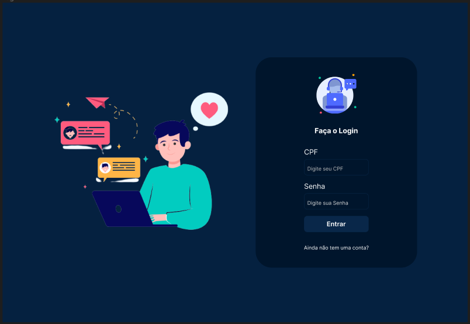

# Requisitos Funcionais
**RF01** - Deverá ser possível fazer login apenas com usuários que estejam cadastrados na base de dados;

**RF02** - Para dados de acesso inválidos, lançar uma exceção com alerta visual ao usuário;

**RF03** - Não deverá ser possível acessar a tela do chat sem estar logado na aplicação;

**RF04** - As conversas entre usuários no chat, devem ser em real time, ou seja, a medida que o usuário envia a mensagem, o outro usuário a recebe no mesmo instante;

**RF05** - Listar os usuários ‘online’;

**RF06** - Ao clicar sobre um usuário, abrir a caixa de digitação de mensagem

**RF07** - Quando um usuário sair da aplicação, a caixa de mensagem para este usuário deverá ser desativada, impossibilitando o envio de novas mensagens;

**RF08** - A sua aplicação deverá poder ser instalada localmente para os testes de avaliação. Não se esqueça de fornecer um arquivo README detalhado do processo de instalação da sua aplicação.

### `Para Rodar o Projeto Backend de forma local`

** npm install ** para baixar todas as dependências do projeto  

** npm start ** backend rodando na porta 6001  

** env-example ** com exemplo das variáveis de ambientes  

** mongo db ** criar banco com duas colections users e messages  

### `Tecnologias utilizados para este projeto`  

**Nodejs**  
**Typescript**  
**Bcrypt**  
**Body-Parser**  
**Cors**  
**Mongoose**  
**DotEnv**  
**Nodemon**  
**Socket.io**  

   

<!--  Front End  -->
### `Para Rodar o Projeto Front End de forma local`  
**npm install** para baixar todas as dependências do projeto  
**npm start** frontend rodando na porta [http://localhost:3000] no browser  

** env-example ** com exemplo das variáveis de ambientes 

### `Tecnologias utilizados para este projeto` 

**React**  
**Typescript**  
**Axios**  
**Buffer**  
**Emoji-Picker-react**   
**React-Avatar-edit**  
**React-Images-uploading**  
**React-Toastify**  
**React-Icons**  
**Socket.io-client**  
**DotEnv**  
**styled-components**  
**uuid**  

Link do Layout desenvolvido por no figma  
https://www.figma.com/file/Zvt5o9UO3K7yZJ2G2Mo4g3/Untitled?type=design&node-id=0-1&t=lAgfmIJ9ZhdM3eWk-0
 

