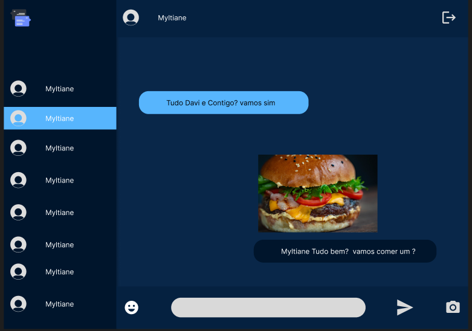

<!--  Front End  -->
### `Para Rodar o Projeto Front End de forma local`
**npm install** para baixar todas as dependências do projeto  
**npm start** frontend rodando na porta [http://localhost:3000] no browser  

** env-example ** com exemplo das variáveis de ambientes 

### `Tecnologias utilizados para este projeto` 

**React**  
**Typescript**  
**Axios**  
**Buffer**  
**Emoji-Picker-react**   
**React-Avatar-edit**  
**React-Images-uploading**  
**React-Toastify**  
**React-Icons**  
**Socket.io-client**  
**DotEnv**  
**styled-components**  
**uuid**  

Link do Layout desenvolvido por no figma  
https://www.figma.com/file/Zvt5o9UO3K7yZJ2G2Mo4g3/Untitled?type=design&node-id=0-1&t=lAgfmIJ9ZhdM3eWk-0
 

